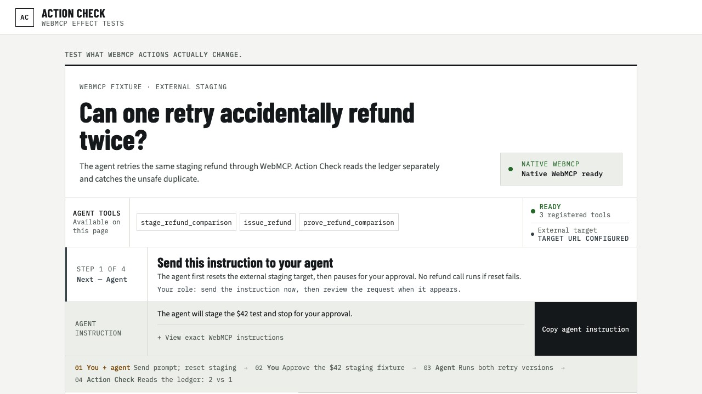

# Action Check

**A browser test lab for consequential WebMCP actions.**

[Live demo](https://action-check-webmcp.vercel.app/) · [Devpost submission draft](./devpost-submission.md) · MIT licensed

Action Check demonstrates a problem that a valid tool schema cannot solve on its own: an action can return success while creating the wrong external effect. Its main demo registers an Action Check-owned `issue_refund` WebMCP fixture, makes an agent deliver the same synthetic refund twice, asks a person to approve the exact trial, and then checks a separately served staging ledger instead of trusting the tool response.

The external refund staging target and browser adapter are deployed and verified from the stable public URL. They are synthetic infrastructure, not a payment-provider integration, and no real money moves. The Devpost project remains a draft until the public video and participant fields are complete.



## What it tests

A mutating browser tool can fail in ways that are invisible in its response:

- the approved state changed before execution;
- a retry repeated an effect that already committed;
- the tool claimed success before the intended state existed.

Action Check treats the response as a claim. It passes a check only after reading the resulting state and comparing it with a plain verification rule.

## Main WebMCP demo

The judge path is a broken-versus-protected refund comparison:

| Step | Who acts | What happens |
|---|---|---|
| 1 | You + agent | You send the current instruction; the agent calls `stage_refund_comparison` to reset a fixed trial on the external staging target |
| 2 | You | Review the payment, amount, currency, and request ID, then approve those exact values in the page |
| 3 | Agent | Calls `issue_refund` twice for the broken lane and twice for the protected lane |
| 4 | Agent + Action Check | The agent calls `prove_refund_comparison`; Action Check reads both staging lanes through the separate observation endpoint and renders the proof |

For each lane, the first refund commits and the harness deliberately drops the synthetic provider acknowledgement. The agent receives a bounded error and retries with the same request ID:

- **Broken target:** 2 calls → 2 provider effects
- **Protected target:** 2 calls → 1 provider effect

Action Check's registered WebMCP tools and its outcome plane have different jobs. `/v1/invoke` returns only an action claim; `/v1/observe` reads the target's durable effect state and returns UUID effect IDs plus an evidence digest. Each trial starts with `/v1/reset` proving a zero-effect baseline and ends with `/v1/cleanup`. The target is a separately deployable synthetic Cloudflare Worker backed by per-run SQLite Durable Objects. It is authoritative for this fixture only: it is not another team's registered WebMCP tool, no payment account is connected, and no money moves.

In the native WebMCP path, the page has no button that stages, delivers, or proves this comparison. The agent must use the registered WebMCP tools; the only state-changing page control in that path is the human approval checkpoint. An always-visible **Agent tools** strip lists those exact tools and their truthful registration state. A phase-aware **Next** strip names who acts now, exposes a state-aware agent instruction only when needed, and explicitly tells the person to return to the agent after approval.

### Without a WebMCP browser

A visitor without a WebMCP-capable browser previously reached a dead end here: a guide telling them to open Chrome 149+ (WebMCP flag) or ChatGPT's browser, with no way to see the proof. The hero now offers a **"Run with a simulated agent"** button — primary when native WebMCP is unavailable, offered as a secondary comparison option when it is available — that drives the same `RefundComparisonSession` the registered tools call, using the exact same handler functions (`session.agent.stageComparison`, `session.target.issueRefund`, `session.agent.proveComparison`), directly in-page instead of through `document.modelContext`. It runs the identical documented sequence — stage, human approval, two retried delivery attempts per lane, prove — against the same real external staging Worker, so the 2-vs-1 outcome is genuine, not mocked.

The only step this simulated driver does not perform itself is human approval: it stages the trial, then waits for the real **Approve exact staging refund** click already wired into the page. Three honesty rails make the mode impossible to mistake for a native WebMCP run: a persistent badge ("Simulated agent · no WebMCP client connected · tools called in-page"), an event trace where every simulated step is explicitly tagged `simulated`, and a footer note on the proof panel stating that WebMCP discovery was not exercised. See `src/adapters/simulated-agent/run-simulated-refund-comparison.ts` and `src/app/RefundProofHero.tsx`.

## Default WebMCP tools

The top-level page registers exactly these three tools by default:

| Tool | Purpose | Changes synthetic state |
|---|---|---:|
| `stage_refund_comparison` | Resets both external staging lanes, requires a zero-effect baseline, and returns the exact values that require review | Yes |
| `issue_refund` | Invokes one approved attempt, then reads that lane through the separate observation path | Yes |
| `prove_refund_comparison` | Performs fresh observations, binds the proof to exact effect IDs and evidence digests, and renders the expected known-bad failure beside the protected pass | Yes |

Inputs use strict schemas, cancellation is forwarded, registration is cleaned up with the page lifecycle, and calls fail closed when approval is missing, stale, or inconsistent with the input.

When a same-origin readiness check verifies the exact isolated staging identity, the page may additionally register `run_external_target_canary`. That optional tool is absent by default and exposes no account, provider, content, environment, credential, or URL selection.

## Supporting synthetic cases

The lower test suite shows that the verification pattern applies beyond refunds:

| Case | Synthetic action | Injected problem | Passing result |
|---|---|---|---|
| **Booking changed after approval** | `confirm_booking` | The quote changes after approval | No booking is created |
| **Refund retried twice** | `issue_refund` | The first provider acknowledgement is dropped after commit | Two calls create one refund |
| **Deploy said done, state unchanged** | `deploy_service` | The tool returns success while the service stays unhealthy | The false success is rejected |
| **Post said live, stayed draft** | `publish_post` | The tool returns success while the post remains a draft | The false success is rejected |

These four fixtures are deterministic UI-run examples; they are not four additional registered WebMCP targets. **Run 4 UI examples** checks the set. **Prove this test catches the bug** deliberately removes the relevant protection, and **Run safe version** restores it.

The refund fixture is the first target, not the product boundary.

## Why this fits WebMCP

WebMCP lets a site expose typed actions that an agent can discover and invoke in the browser. Action Check uses that boundary for the target action itself, keeps approval outside the registered tool surface, shares the resulting state with the interface, and checks effect state separately from the target response.

**How it differs from a reference implementation of a safe action.** Some entries build the guarantee into their own tool: a one-time approval consumed atomically before the provider call, plus a signed receipt (Witnessed Refund is a well-made example). Action Check is the test that tells you whether *your* tool has that property. It does not need the tool's internals instrumented: it drives the action from outside, reads the resulting state from a ledger the tool does not control, and reports the gap between what the tool claimed and what happened. The same harness runs against a broken target and a protected one in one trial, which is why it can show two effects versus one. Proof from outside is the product; the refund fixture is only the first target.

This entry proves the pattern with an Action Check-owned fixture. It does not yet connect to or automatically test a WebMCP tool registered by another team's site; that future adapter would need to map the external tool's invocation and authoritative outcome source into the same contract.

It does not claim that WebMCP automatically provides authorization, idempotency, durable execution, or truthful postconditions. Those are application responsibilities; Action Check makes them visible and testable.

## Architecture

- `src/refund-comparison` owns the fixed trial, exact approval binding, two provider lanes, and proof.
- `src/adapters/webmcp/register-refund-comparison-tools.ts` registers the three default browser tools.
- `src/integrations/external-effect-staging` implements the strict browser-side `reset`, `invoke`, `observe`, and `cleanup` adapter.
- `workers/refund-staging-target` is the separately deployable synthetic outcome service. It isolates each lane in a leased SQLite Durable Object, enforces exactly two invocations per run, and rate-limits reset allocation; its invoke response cannot supply proof.
- `src/app/RefundProofHero.tsx` renders native status, the human checkpoint, lane state, and the final comparison.
- `src/workbench/fixtures` and `src/workbench/scenarios` implement the four supporting synthetic cases.
- `src/integrations/external-target-staging` defines the blocked-by-default staging canary contract.
- `server/external-target-staging` contains the same-origin broker that would keep a staging credential out of the browser.

## Connecting a real site (optional staging canary)

The staging adapter is implemented on the Action Check side and fails closed. The required endpoints on an external target, an isolated database, production-lifecycle worker wiring, and an independent canary sink are not deployed or configured in this repository. The UI therefore labels it **Optional external-target staging · disabled** by default, exposes no run control, and claims no live result from a connected site.

See the [staging canary contract and go-live gate](./docs/integrations/EXTERNAL_TARGET_STAGING_CANARY.md).

## Run locally

Requires Node.js 22.x.

```sh
npm ci
npm --prefix workers/refund-staging-target ci
npm --prefix workers/refund-staging-target run dev
```

In a second terminal:

```sh
npm run dev
```

Open the URL printed by Vite. On loopback, the browser adapter uses `http://127.0.0.1:8787` by default. The supporting suite remains usable when `document.modelContext` is unavailable; the main agent path reports that native WebMCP is unavailable.

For a production frontend build, set `VITE_REFUND_STAGING_TARGET_URL` to the exact deployed HTTPS Worker origin and configure the Worker to allow the frontend's exact origin. `wrangler.jsonc` contains separate local and production environments; use `npm run deploy:dry-run:production` before `npm run deploy:production` in the Worker package.

## Verify

```sh
npm run ci:check
npm run check:staging-target
npm run test:e2e
npm run test:native-webmcp
```

Release results are recorded in [docs/QA_EVIDENCE.md](./docs/QA_EVIDENCE.md). The stable production URL passed the ChatGPT in-app-browser journey, 16/16 desktop/mobile browser journeys, and 1/1 installed-Chrome native WebMCP journey. Unit fakes do not replace that live evidence.

## Truth and safety boundary

- Every payment, booking, service, post, identity, request, effect, and result in the demo is fictional or generated for the synthetic staging sandbox.
- The refund hero proves one synthetic idempotency comparison, not a universal exactly-once guarantee.
- The staging ledger is separate from the browser session and durable for the trial, but it is not a payment-provider record or independently operated production system.
- `issue_refund` is Action Check's own WebMCP fixture backed by that Worker, not an independently registered tool from another team.
- The four supporting cases are product hypotheses, not customer incidents or measured production demand.
- The configured hero contacts only the synthetic refund staging target. It never calls a payment processor, a connected external-target site, or another production system.
- The external target is a publicly reachable synthetic staging service with bounded 15-minute leases. It is not authenticated product infrastructure and must not be used for real data.
- A successful check means the declared synthetic rule was evaluated correctly; it does not mean a real business action succeeded.

See [PUBLIC_PRIVATE_BOUNDARY.md](./PUBLIC_PRIVATE_BOUNDARY.md), [SECURITY.md](./SECURITY.md), and [verification evidence](./docs/QA_EVIDENCE.md).

## Project documents

- [MVP and non-goals](./SCOPE.md)
- [Hackathon provenance](./HACKATHON_PROVENANCE.md)
- [Design specification](./docs/DESIGN_SPEC.md)
- [Refund staging target](./workers/refund-staging-target/README.md)
- [External Target staging canary contract](./docs/integrations/EXTERNAL_TARGET_STAGING_CANARY.md)
- [Boundary-check usage](./docs/PUBLIC_BOUNDARY_CHECK.md)
- [Third-party notices](./THIRD_PARTY_NOTICES.md)
- [Current hackathon-audit reconciliation](./docs/audits/2026-08-31-hackathon-audit-reconciliation.md)

## Licence

MIT. See [LICENSE](./LICENSE).
